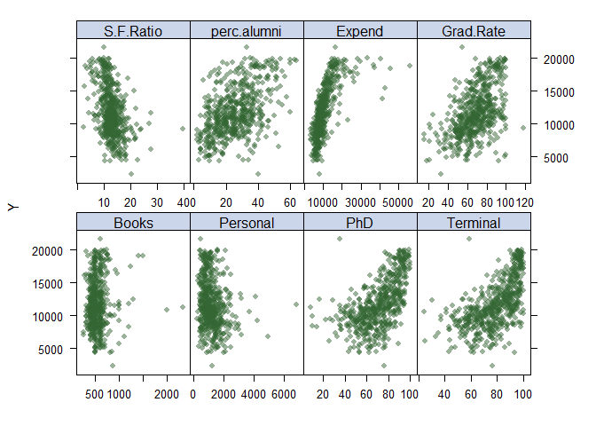

p8106\_hw2\_dd2948
================
David DeStephano
March 15, 2020

``` r
library(caret)
library(splines)
library(lasso2) 
library(mgcv)
library(tidyverse)
library(ggplot2)
library(earth)
library(pdp)
```

Import the data
===============

``` r
college<-read_csv("College.csv")
```

Set seed to 2
=============

``` r
set.seed(2)
```

Scatter plots of response vs. predictors.
=========================================

``` r
college %>%
  gather(-Outstate, -College, key = "var", value = "value") %>%
  ggplot(aes(x = value, y = Outstate)) +
    geom_point() +
    facet_wrap(~ var, scales = "free_x") +
    theme_bw()
```

    ## Warning: Removed 16 rows containing missing values (geom_point).


Alternative plot
================

``` r
map(college, ~sum(is.na(.)))
```

    ## $College
    ## [1] 0
    ## 
    ## $Apps
    ## [1] 0
    ## 
    ## $Accept
    ## [1] 0
    ## 
    ## $Enroll
    ## [1] 0
    ## 
    ## $Top10perc
    ## [1] 0
    ## 
    ## $Top25perc
    ## [1] 0
    ## 
    ## $F.Undergrad
    ## [1] 0
    ## 
    ## $P.Undergrad
    ## [1] 0
    ## 
    ## $Outstate
    ## [1] 1
    ## 
    ## $Room.Board
    ## [1] 0
    ## 
    ## $Books
    ## [1] 0
    ## 
    ## $Personal
    ## [1] 0
    ## 
    ## $PhD
    ## [1] 0
    ## 
    ## $Terminal
    ## [1] 0
    ## 
    ## $S.F.Ratio
    ## [1] 0
    ## 
    ## $perc.alumni
    ## [1] 0
    ## 
    ## $Expend
    ## [1] 0
    ## 
    ## $Grad.Rate
    ## [1] 0

``` r
college2<-college %>% select(-College) %>% select(-Outstate,Outstate) %>% filter(!is.na(Outstate))


# matrix of predictors
x <-model.matrix(Outstate~.,college2)[,-1]
# vector of response
y <- college2$Outstate


theme1 <-trellis.par.get()
theme1$plot.symbol$col <-rgb(.2, .4, .2, .5)
theme1$plot.symbol$pch <- 16
theme1$plot.line$col <-rgb(.8, .1, .1, 1)
theme1$plot.line$lwd <- 2
theme1$strip.background$col <-rgb(.0, .2, .6, .2)
trellis.par.set(theme1)

featurePlot(x, y, plot = "scatter", labels =c("","Y"),type =c("p"), layout =c(4, 2))
```



b) Fit a smoothing spline model using Terminal as the only predictor of Outstate for a range of degrees of freedom, as well as the degree of freedom obtained by generalized cross-validation, and plot the resulting fits. Describe the results obtained.
==========================================================================================================================================================================================================================================================

``` r
fit.ss <-smooth.spline(college2$Terminal, college2$Outstate)
fit.ss$df
```

    ## [1] 4.468629

``` r
Terminallims <-range(college2$Terminal)
Terminal.grid <-seq(from = Terminallims[1],to = Terminallims[2])

pred.ss <-predict(fit.ss,
                  x = Terminal.grid)

pred.ss.df <-data.frame(pred = pred.ss$y,
                        Terminal = Terminal.grid)

p <-ggplot(data = college2,aes(x = Terminal, y =Outstate)) +
  geom_point(color =rgb(.2, .4, .2, .5))

p+geom_line(aes(x = Terminal, y = pred), data = pred.ss.df,color =rgb(.8, .1, .1, 1))+ theme_bw()
```


(c) Fit a generalized additive model (GAM) using all the predictors. Plot the results and explain your findings.
================================================================================================================

``` r
gam.m1 <-gam(Outstate~Apps+Accept+Enroll+Top10perc+Top25perc+F.Undergrad+P.Undergrad+Room.Board+Books+ Personal+PhD+Terminal+S.F.Ratio+perc.alumni+Expend+Grad.Rate, data = college2)


gam.m2 <-gam(Outstate~Apps+Accept+Enroll+Top10perc+Top25perc+F.Undergrad+P.Undergrad+Room.Board+Books+ Personal+PhD+s(Terminal)+S.F.Ratio+perc.alumni+Expend+Grad.Rate, data = college2)


gam.m3 <-gam(Outstate~Apps+Accept+Enroll+Top10perc+Top25perc+F.Undergrad+P.Undergrad+te(Room.Board, Personal)+Books+ PhD+s(Terminal)+S.F.Ratio+perc.alumni+Expend+Grad.Rate, data = college2)


gam.m3 <-gam(Outstate~Apps+Accept+Enroll+Top10perc+Top25perc+F.Undergrad+P.Undergrad+te(Room.Board, Personal)+Books+ PhD+s(Terminal)+S.F.Ratio+perc.alumni+Expend+Grad.Rate, data = college2)


gam.m4 <-gam(Outstate~Apps+te(Accept, Enroll)+Top10perc+Top25perc+F.Undergrad+P.Undergrad+te(Room.Board, Personal)+Books+ PhD+s(Terminal)+S.F.Ratio+perc.alumni+Expend+Grad.Rate, data = college2)


anova(gam.m1, gam.m2, gam.m3, gam.m4, test = "F")
```

    ## Analysis of Deviance Table
    ## 
    ## Model 1: Outstate ~ Apps + Accept + Enroll + Top10perc + Top25perc + F.Undergrad + 
    ##     P.Undergrad + Room.Board + Books + Personal + PhD + Terminal + 
    ##     S.F.Ratio + perc.alumni + Expend + Grad.Rate
    ## Model 2: Outstate ~ Apps + Accept + Enroll + Top10perc + Top25perc + F.Undergrad + 
    ##     P.Undergrad + Room.Board + Books + Personal + PhD + s(Terminal) + 
    ##     S.F.Ratio + perc.alumni + Expend + Grad.Rate
    ## Model 3: Outstate ~ Apps + Accept + Enroll + Top10perc + Top25perc + F.Undergrad + 
    ##     P.Undergrad + te(Room.Board, Personal) + Books + PhD + s(Terminal) + 
    ##     S.F.Ratio + perc.alumni + Expend + Grad.Rate
    ## Model 4: Outstate ~ Apps + te(Accept, Enroll) + Top10perc + Top25perc + 
    ##     F.Undergrad + P.Undergrad + te(Room.Board, Personal) + Books + 
    ##     PhD + s(Terminal) + S.F.Ratio + perc.alumni + Expend + Grad.Rate
    ##   Resid. Df Resid. Dev      Df  Deviance      F    Pr(>F)    
    ## 1    547.00 2092185295                                       
    ## 2    542.37 2026858216  4.6295  65327078 4.1200  0.001543 ** 
    ## 3    534.94 1940535407  7.4277  86322809 3.3932  0.001153 ** 
    ## 4    524.29 1810986378 10.6562 129549029 3.5495 9.731e-05 ***
    ## ---
    ## Signif. codes:  0 '***' 0.001 '**' 0.01 '*' 0.05 '.' 0.1 ' ' 1

``` r
plot(gam.m2)
```


``` r
vis.gam(gam.m3, view =c("Room.Board","Personal"),plot.type = "contour", color = "topo")
```


``` r
plot(gam.m4)
```


``` r
vis.gam(gam.m4, view =c("Accept","Enroll"),plot.type = "contour", color = "topo")
```


According to the anova procedure, model 4 is the best fitting model

(d) Fit a multivariate adaptive regression spline (MARS) model using all the predictors. Report the final model. Present the partial dependence plot of an arbitrary predictor in your final model.
===================================================================================================================================================================================================

``` r
ctrl1 <-trainControl(method = "cv", number = 10)
mars_grid <-expand.grid(degree = 1:4,
                        nprune =2:25)

mars.fit <-train(x, y,
                 method = "earth",
                 tuneGrid = mars_grid,
                 trControl = ctrl1)

ggplot(mars.fit)
```


``` r
mars.fit$bestTune
```

    ##    nprune degree
    ## 19     20      1

``` r
coef(mars.fit$finalModel)
```

    ##         (Intercept)     h(Expend-15365)  h(4450-Room.Board) 
    ##       11263.1644592          -0.6232067          -1.3019686 
    ##     h(Grad.Rate-97)     h(97-Grad.Rate) h(F.Undergrad-1355) 
    ##        -240.4181519         -22.0705355          -0.3455994 
    ## h(1355-F.Undergrad)   h(22-perc.alumni)        h(Apps-3712) 
    ##          -1.6975458         -74.5653989           7.0546188 
    ##    h(1300-Personal)       h(913-Enroll)      h(2193-Accept) 
    ##           1.0518029           4.7810367          -1.8020047 
    ##      h(Expend-6881)        h(Apps-3877)   h(S.F.Ratio-10.1) 
    ##           0.6430814          -6.7165025        -131.6442126 
    ##   h(10.1-S.F.Ratio)   h(S.F.Ratio-17.8)           h(PhD-81) 
    ##        -276.0954428         264.3799299          58.2239473

Partial Dependence plot

``` r
p1 <-partial(mars.fit, pred.var =c("Room.Board"), grid.resolution = 10)%>% autoplot()

p2 <-partial(mars.fit, pred.var =c("Room.Board","Personal"), grid.resolution = 10)%>%plotPartial(levelplot = FALSE, zlab = "yhat", drape = TRUE,screen =list(z = 20, x = -60))

grid.arrange(p1, p2, ncol = 2)
```


Compare to caret GAM
====================

``` r
gam.fit <-train(x, y,
                method = "gam",
                tuneGrid =data.frame(method = "GCV.Cp", select =c(TRUE,FALSE)),
                trControl = ctrl1)


bwplot(resamples(list(mars = mars.fit,gam = gam.fit)), metric = "RMSE")
```


``` r
gam.m4
```

    ## 
    ## Family: gaussian 
    ## Link function: identity 
    ## 
    ## Formula:
    ## Outstate ~ Apps + te(Accept, Enroll) + Top10perc + Top25perc + 
    ##     F.Undergrad + P.Undergrad + te(Room.Board, Personal) + Books + 
    ##     PhD + s(Terminal) + S.F.Ratio + perc.alumni + Expend + Grad.Rate
    ## 
    ## Estimated degrees of freedom:
    ## 12.36  8.51  2.38  total = 35.25 
    ## 
    ## GCV score: 3653326

``` r
resamp <- resamples(list(gam=gam.fit,
                         ridge=mars.fit))

summary(resamp)
```

    ## 
    ## Call:
    ## summary.resamples(object = resamp)
    ## 
    ## Models: gam, ridge 
    ## Number of resamples: 10 
    ## 
    ## MAE 
    ##           Min.  1st Qu.   Median     Mean  3rd Qu.     Max. NA's
    ## gam   1012.660 1251.970 1440.060 1384.288 1516.381 1627.591    0
    ## ridge 1062.586 1159.266 1385.627 1334.407 1438.803 1637.302    0
    ## 
    ## RMSE 
    ##           Min.  1st Qu.   Median     Mean  3rd Qu.     Max. NA's
    ## gam   1307.512 1652.394 1831.630 1788.109 1951.456 2131.387    0
    ## ridge 1330.183 1517.869 1761.304 1712.300 1877.553 2142.005    0
    ## 
    ## Rsquared 
    ##            Min.   1st Qu.    Median      Mean   3rd Qu.      Max. NA's
    ## gam   0.6757425 0.7425273 0.7588392 0.7715996 0.8122629 0.8862215    0
    ## ridge 0.6889092 0.7297082 0.8039105 0.7869848 0.8272647 0.8875854    0

(e) Based on the above GAM and MARS models, predict the out-of-state tuition of Columbia University.
====================================================================================================

``` r
columbia<-college %>% filter(College=="Columbia University")
pred.gam <-predict(gam.fit, newdata =columbia)
pred.mars <-predict(mars.fit, newdata =columbia)

#predicted using the MGCV GAM instead of Caret
pred.mgcvgam=predict(gam.m4,newdata=columbia,se = TRUE)


pred.gam
```

    ##        1 
    ## 17728.51

``` r
pred.mars
```

    ##             y
    ## [1,] 18456.89

``` r
pred.mgcvgam
```

    ## $fit
    ##        1 
    ## 19240.62 
    ## 
    ## $se.fit
    ##        1 
    ## 712.0011

The predicted value for the GAM model is $17728.51, and the predicted value for the MARs model is $18456.89 The predicted value using the fourth MGCV GAM model was 19240.62

For b) not sure if plotted both with range of DF and CV DF
